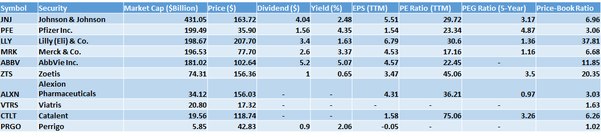
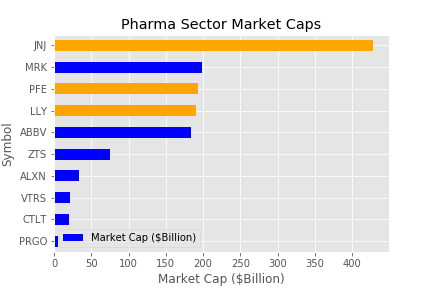
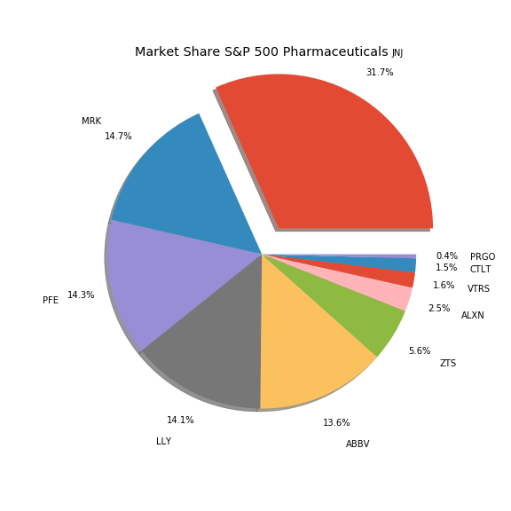
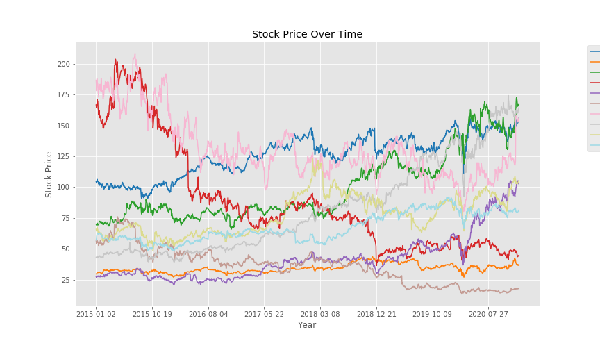
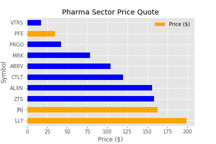
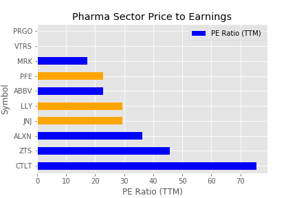
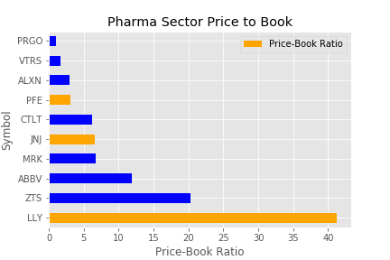
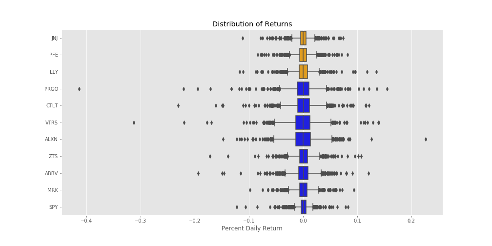
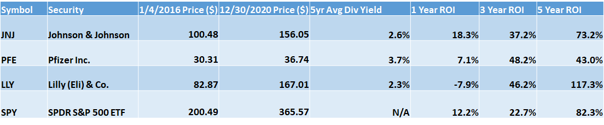

# STOCK MARKET ANALYSIS: S&P 500 PHARMACEUTICALS

---
## Executive Summary

The pharmaceutical industry is part of the larger healthcare sector. Companies in the pharmaceutical industry research, develop, manufacture, and market medicines and drugs. Pharmaceutical stocks, as represented by the iShares U.S. Pharmaceuticals ETF (IHE), have underperformed the broader market over the past year. IHE has provided a total return of 16.3% over the last 12 months, below the Russell 1000's total return of 21.9%, as of December 2, 2020. All information outlined in this presentation is current as of February 1st, 2021. This analysis evaluates the top ten pharmaceutical stocks within the S&P 500, draws conclusions and makes recommendations based upon available data. 

---
## Methodology 

Utilizing the [Yahoo Finance API](https://algotrading101.com/learn/yahoo-finance-api-guide/) construct a high-level summary of the top then pharmaceutical companies within the S&P 500. 

### What is the Yahoo Finance API?
The well-known Yahoo Finance API was terminated in 2017, and as it stands today is an amalgamation of Rapid API's and Web Scrapers. 

### Pros
* It's Free!!!
* Easy Setup
* Simple to operate
* Access to a relatively large amount of data

### Cons
* Simple -> Basic
* Fragile 
* Not of high throughput analysis
* Can become rate limited or blacklisted

Please visit the link [here](https://algotrading101.com/learn/yahoo-finance-api-guide/) for further information on Yahoo Finance. 

---
## Pharmaceutrical Companies
* JNJ - Johnson & Johnson
* PFE - Pfizer Inc.
* LLY - Eli Lilly & Co.
* MRK - Merck & Co.
* ABBV - AbbVie Inc.
* ZTS - Zoetis
* ALXN - Alexion Pharmaceuticals
* VTRS - Viatris
* CTLT - Catalent
* PRGO - Perrigo

---
## Market Capitalization

### What is Market Cap?

* Market Cap is defined as Current Market Price times Shares Outstanding.
* Used to gauge company size and market share.
* Companies with a Market Capitalization greater than $10 Billion are considered “Blue Chip”.

#### Johnson & Johnson
* Clear sector leader with close to a third of market share by capital.

* More than half of remaining market:
    * Pfizer
    * Lilly (Eli)
    * Merck
    * AbbVie

---
## Price

### Price Trends by Company (5-Year)

### Price Snapshot by Company

---
## PE Ratio

### What is PE Ratio?

* The price-to-earnings ratio (P/E ratio) is the ratio for valuing a company that measures its current share price relative to its per-share earnings (EPS).
 
* The price-to-earnings ratio is also sometimes known as the price multiple or the earnings multiple.

* Top three companies sit within a close PE range of ~(25 – 30) 

* Two companies did not report PE:
    * PRGO
    * VTRS

---
## PEG Ratio

### What is PEG Ratio?

* The price/earnings to growth ratio (PEG ratio) is a stock's price-to-earnings (P/E) ratio divided by the growth rate of its earnings for a specified time period. 

* The PEG ratio is used to determine a stock's value while also factoring in the company's expected earnings growth, and it is thought to provide a more complete picture than the more standard P/E ratio.

* Of the top three companies by Market Cap: 
    * LLY: Highest Growth Potential
    * JNJ: Modest Growth Potential
    * PFE: Lowest Growth Potential

* PRGO, VTRS, & ABBV did not report PEG at the time of this analysis.

---
## PB Ratio

### What is PB Ratio?
* What price should investors pay for a company's equity shares? If the goal is to unearth high-growth companies selling at low-growth prices, the price-to-book ratio (P/B) offers investors an effective approach to finding undervalued companies.

* The P/B ratio can also help investors identify and avoid overvalued companies. However, the price-to-book ratio has its limitations and there are circumstances where it may not be the most effective metric for valuation.

* Of the top three by Market Cap this analysis suggests that LLY may be significantly overvalued compared to its’ peers in the pharmaceutical sector.

---
## Return Estimation 

### Distribution of Daily Returns

### ROI
* Return on Investment (ROI) is a performance measure used to evaluate the efficiency of an investment or compare the efficiency of a number of different investments. ROI tries to directly measure the amount of return on a particular investment, relative to the investment’s cost. 

* To calculate ROI, the benefit (or return) of an investment is divided by the cost of the investment. The result is expressed as a percentage or a ratio. 

---
## Recommendations & Conclusions

* Johnson & Johnson (JNJ) while very healthy in terms of presented metrics, may be price prohibitive to retail investors.

* Pfizer Inc. (PFE) while growth prospects appear small, low entry price and high dividend yield may be more palatable for investors seeking cash flow from dividends. Current vaccine production does not appear to be priced in.

    * Recommend deeper investigation into PFE financials.

* Eli Lilly & Co (LLY) highest price per share and PB ratio compared to sector is quite high at ~37x vs ~7x. Market does expect higher growth from (LLY), but we feel this is overpriced into the stock.

    * Recommend thorough review of M&A activity with any additional financial assessment.

---
## Resources & Acknowledgements

* [Investopedia](https://www.investopedia.com/): Since Investopedia was launched in 1999, we’ve made it our mission to simplify complex financial information and decisions for our readers, giving them the confidence to manage every aspect of their financial life.

* [AlgoTrading101](https://algotrading101.com/learn/yahoo-finance-api-guide/): The Yahoo Finance API is a range of libraries/APIs/methods to obtain historical and real time data for a variety of financial markets and products, as shown on Yahoo Finance- https://finance.yahoo.com/.